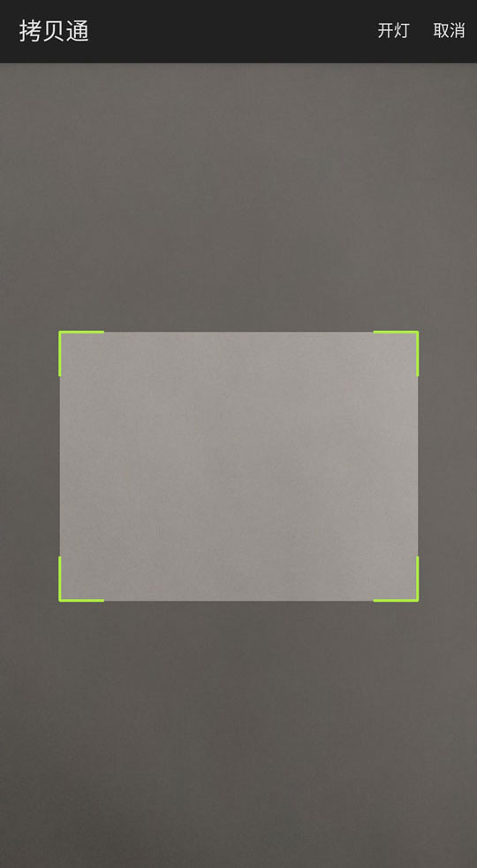
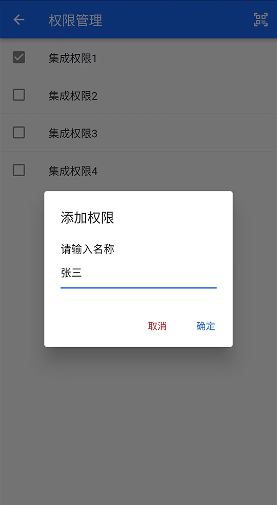
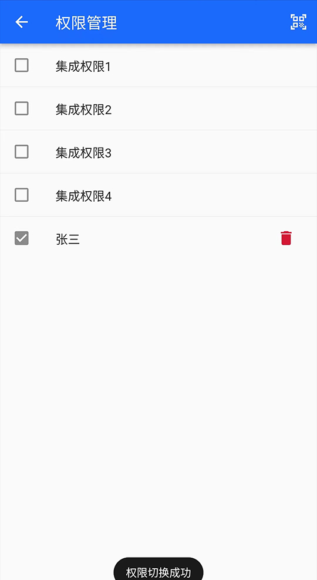
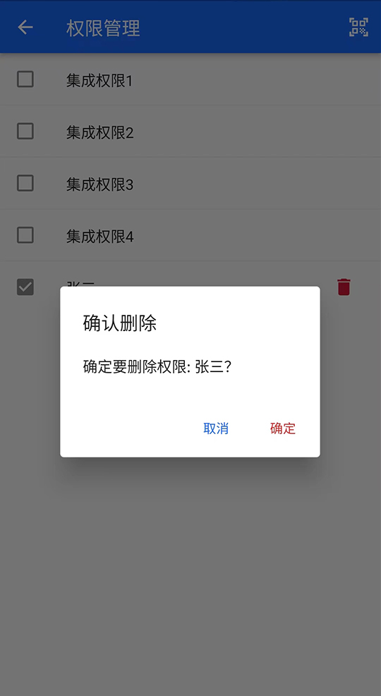
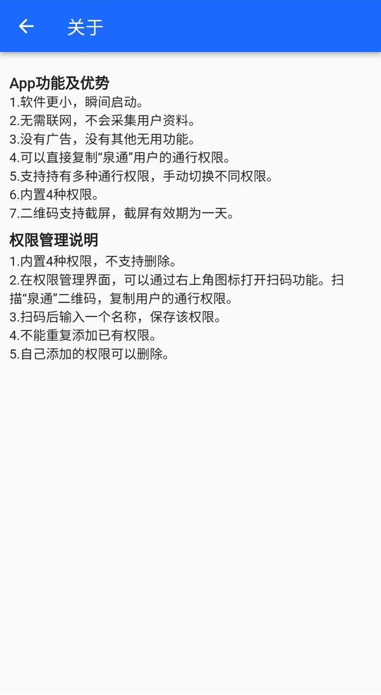

# 拷贝通 

## 使用范围
使用拷贝通（CopyTong、CT）之前请确定，该App未必对你有用。

* **泉通：** “拷贝通”实现了“泉通”的通行二维码功能。使用前请确定你正在使用“泉通”App的二维码通行功能，并且泉通的其他功能对你形成了困扰。
* **汉峪金谷：** “泉通”的通行二维码目前仅在济南市高新区汉峪金谷园区有用，如果其他园区使用“泉通”的通行二维码，理论上“拷贝通”也可以使用。

## 软件优势
拷贝通具有以下优势：

*  软件更小，瞬间启动。
*  无需联网，不会采集用户资料。
*  没有广告，没有其他无用功能。
*  可以直接复制“泉通”用户的通行权限。
*  支持持有多种通行权限，手动切换不同权限。
*  内置4种权限。
*  二维码支持截屏，截屏有效期为一天。

## 软件截图

 
 
 
 